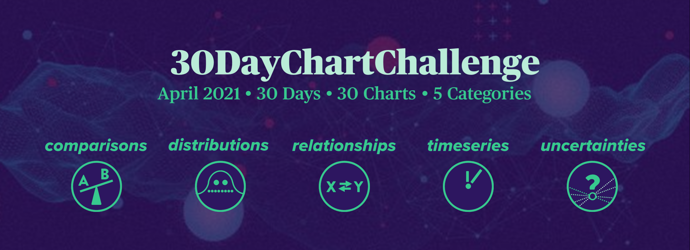
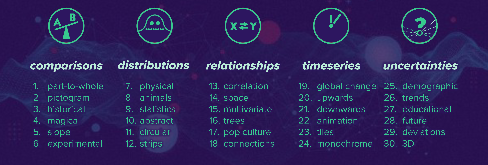

<em>Collection of contributions to and resources for the first <a href="https://twitter.com/30DayChartChall">#30DayChartChallenge</a> in April 2021.</em>

## How to contribute?

Anyone is welcome to contribute, no matter which data source or tool you use.  
If you share your contributions on Twitter, please use the hashtag [#30DayChartChallenge](https://twitter.com/search?q=%2330DayChartChallenge) and/or tag the [@30DayChartCall](https://twitter.com/30DayChartChall) account.

## Topics

## Contributions

Collection of all contributions per day (shared on Twitter with the hashtag and/or mentioning @30DayChartChall account)

**Comparisons:**
* [Day 1: Part-to-whole](https://github.com/Z3tt/30DayChartChallenge_Collection2021/tree/main/contributions/day1_part_to_whole)

*Further links:*

* [Collection of contributions done in #Rstats](https://github.com/dominicroye/rstats-chart-challenge-2021)
* [#30DayChartChallenge](https://twitter.com/search?q=%2330DayChartChallenge) on Twitter

## Resources

### Tools

We do not care what tool you use. Whatever works for you is fine! Programing, designing, crafting — pick what you prefer or try different things.  An extensive list of tools can be found at [Visualising Data](https://www.visualisingdata.com/resources/).

### Data

You are free to pick whatever data you want—we do not provide any particular dataset for each challenge. Either use the same dataset for all or different datasets each day, as you like! Search the internet, collect your own, visualize daily experiences or funny stats. Nevertheless, we would like to provide a starter kit of possible data sources:

* [Google dataset search](https://datasetsearch.research.google.com/)
* [data.world](https://data.world/)
* [kaggle](https://www.kaggle.com/datasets)
* [Data Is Plural](https://docs.google.com/spreadsheets/d/1wZhPLMCHKJvwOkP4juclhjFgqIY8fQFMemwKL2c64vk/edit#gid=0)
* [OurWorldInData](https://ourworldindata.org/)
* [Eurostats](https://ec.europa.eu/eurostat)
* [UN Stats](https://unstats.un.org/home/)
* [WHO](https://www.who.int/data/collections)
* [OECD Stats](https://stats.oecd.org/)
* [Socioeconomic Data and Applications Center (NASA)](https://sedac.ciesin.columbia.edu/)
* [MakeoverMonday](https://www.makeovermonday.co.uk/data/)
* [TidyTuesday](https://github.com/rfordatascience/tidytuesday/tree/master/data/2021) (search through old datasets [here](https://github.com/rfordatascience/tidytuesday/tree/master/data/2018), [here](https://github.com/rfordatascience/tidytuesday/tree/master/data/2019) and [here](https://github.com/rfordatascience/tidytuesday/tree/master/data/2020))
* [IMDB datasets](https://www.imdb.com/interfaces/)
* [Free GIS data](http://freegisdata.rtwilson.com/)
* [WorldClim](https://worldclim.org/) — maps, graphs, tables, and data of the global climate
* [Rdatasets](https://vincentarelbundock.github.io/Rdatasets/datasets.html) — over 1300 datasets originally distributed in R packages
* [List of R packages to import data](https://www.computerworld.com/article/3109890/these-r-packages-import-sports-weather-stock-data-and-more.html)

### Chart Type Selection

There are many great selection helpers out there, guiding you through the many different boxes you can fit the endless number of (sub)chart types in. Here is a non-exhaustive list:

* [Chart Suggestions—A Thought-Starter](http://extremepresentation.com/wp-content/uploads/choosing-a-good-chart-09-1.pdf) by Andrew Abela — an all-time classic ([latest version](https://extremepresentation.typepad.com/files/chart-chooser-2020.pdf))
* [Graphic Continuum](https://policyviz.com/2014/09/09/graphic-continuum/) by Jon Schwabish and Severino Ribecca — the main source for the five categories
* [Visual Vocabulary](https://github.com/ft-interactive/chart-doctor/tree/master/visual-vocabulary) by the Financial Times Visual Journalism  — chart choice helpers with lots of further links
  + [interactive version](https://www.ft.com/chart-doctor) 
  + [static version](https://raw.githubusercontent.com/ft-interactive/chart-doctor/master/visual-vocabulary/poster.png)
* [From Data to Viz](https://www.data-to-viz.com/) by Yan Holtz — interactive, with information and codes for each chart type
  + [R code collection](https://www.r-graph-gallery.com/)
  + [Python code collection](https://www.python-graph-gallery.com/)
  + [D3js code collection](https://www.d3-graph-gallery.com/)
* [DataVizProject](https://datavizproject.com/) by ferdio — interactive with lots of examples
* [Visualization Universe](http://visualizationuniverse.com/) by Adioma and Google News Lab
* [How to Choose the Right Chart Type](https://activewizards.com/blog/how-to-choose-the-right-chart-type-infographic/) — another, very compact, decision tree to help you
